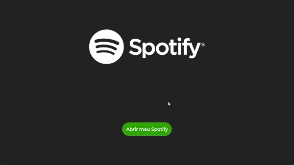

# UI Spotify com Angular

Visual Web



---

## 🔖Sobre

**UI utilizando a API do Spotify com Angular.**

- A aplicação permite controlar a execução de músicas.
- Playlists/Músicas Curtidas do usuário logado.
- Top artista/Top 5+ músicas.
- Player sincronizado.

## 💾Instalação

**Instalar dependencias:**

```shell
$ npm install
```

```shell
$ npm i @angular/cli -g
```
**Antes de rodar o projeto:**

- Faça login com sua conta do Spotify em http://developer.spotify.com

- Copie a Client ID e insira em environment.ts, linha 10.
Crie um App na plataforma e adicione a URI http://localhost:4200/login/ nas configurações

**Execução:**

```shell
$ ng serve -o
```


Projeto baseado neste [Repositório](https://github.com/cristianWilliam/Spotify-Angular).

Créditos ao [Cristian William](https://github.com/cristianWilliam).

---

Desenvolvido por Márkys Corrêa.
